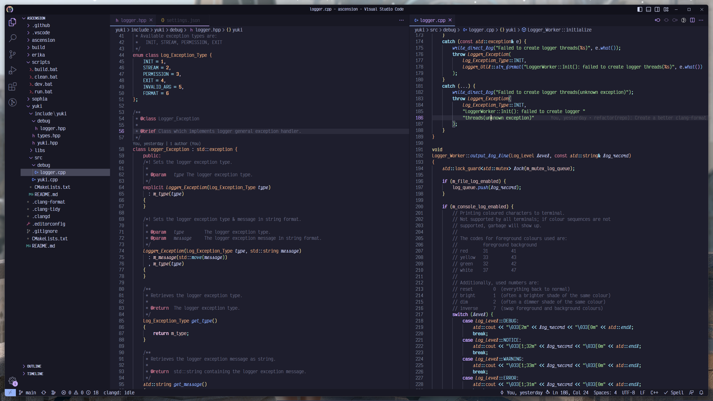

# VS Code Custom CSS

This repository aims to provide my personal VS Code CSS customisations using the [VS Code custom CSS extension](https://marketplace.visualstudio.com/items?itemName=be5invis.vscode-custom-css). This allows simpler sharing of custom themes and keeping multiple machines in sync.

## Usage

1. Install the [VS Code custom CSS extension](https://marketplace.visualstudio.com/items?itemName=be5invis.vscode-custom-css)
2. Install the [Fix VS Code checksums extension](https://marketplace.visualstudio.com/items?itemName=lehni.vscode-fix-checksums)
3. Add links to CSS files to your settings

```json
"vscode_custom_css.imports": [
    "file:///local_css_file",
    "https://global_css_file"
],
```
4. Run VS Code as an administrator
5. Run `Reload Custom CSS and JS` command while connected to the internet
6. Click the `Restart Visual Studio Code` button on the pop-up in the bottom-right
7. Run `Fix Checksums: Apply` command to remove corrupt installation warning
8. Close VS Code and continue to use normally (without administrator)

## Examples

```json
"vscode_custom_css.imports": [
    "https://raw.githubusercontent.com/r-ggraham/vs-code-custom-css/main/VisualStudioCode.css"
],
```
